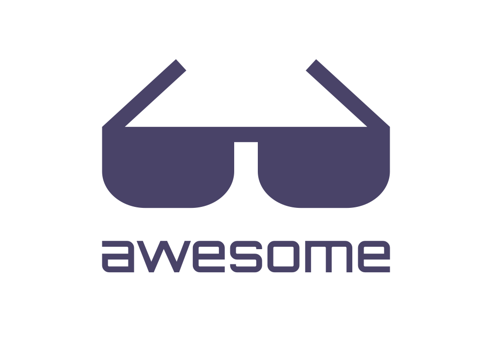

	
	 
	 
	 
	 

 
 
 
 
 

[中文](readme.zh.md) | [English](readme.md)

 
 
 

## Contents

- [Contents](#contents)
- [Limit QPS](#limit-qps)
- [Easily blocked IP, Limit models](#easily-blocked-ip-limit-models)
- [Limit QPS/times/models](#limit-qpstimesmodels)
- [Limit total times/tokens/RPM/PRD](#limit-total-timestokensrpmprd)

 

## Limit QPS

- [CogniHub](https://cognihub.baystoneai.com) - I am CogniHub API to provide developers with large model reasoning API registered developer accounts, you can get APPKEY can switch all major large language models on the market, compatible with the OpenAI API

## Easily blocked IP, Limit models

- [gpt4free](https://github.com/xtekky/gpt4free) - The official gpt4free repository | various collection of powerful language models

## Limit QPS/times/models

- [GPT_API_free](https://github.com/chatanywhere/GPT_API_free) - Free CHATGPT API Key, Free CHATGPT API, support GPT4 API (Free) , CHATGPT domestic available Free forwarding API, direct connect without proxy. Can be used with ChatBox and other software/plug-ins, greatly reduce the cost of using the interface. Domestic can be unlimited free chat.

## Limit total times/tokens/RPM/PRD

- [Coze](https://www.coze.com/docs/developer_guides/coze_api_overview) - Coze is a next-generation AI application and chatbot development platform. Regardless of your programming experience, Coze enables you to effortlessly create various chatbots and deploy them across different social platforms and messaging apps.
